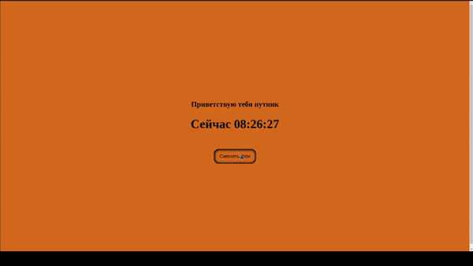

# Hello Time

### Use Skills

---

[Demo Link   ](https://golovanovalex.github.io/HelloTime)

### Info

Создано на основе задания от [Result School](https://result.school/products).  
Для обучения и отработки работы c CSS и JavaScript.  
Изменение и смена фона при нажатии на кнопку.
Отображение актуального времени.

---

### Contacts

- <a href="mailto:golovanov.a.a@yandex.ru" >Golovanov.a.a@yandex.ru</a>

  Made with 💙
